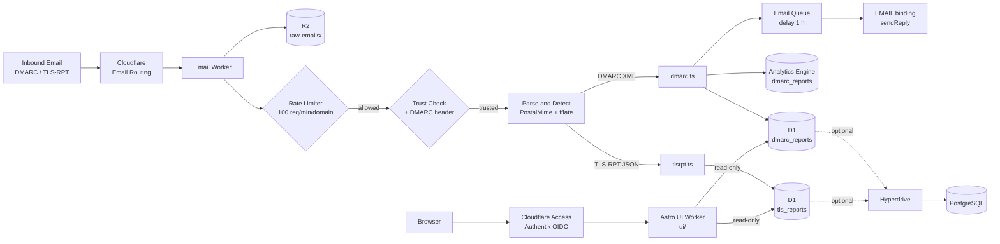
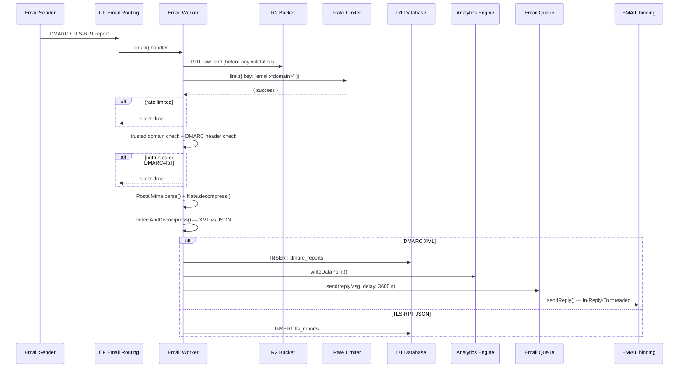

# dmarc-email-worker

Two Cloudflare Workers: an email ingest worker that receives DMARC aggregate reports and TLS-RPT reports, parses them, and writes to D1; and a read-only Astro UI worker for browsing reports.

---

## Architecture



## Email flow



---

## Cloudflare bindings

| Binding         | Type                        | Purpose                          | Required     |
| --------------- | --------------------------- | -------------------------------- | ------------ |
| `DB`            | D1 Database                 | Primary report storage           | Yes          |
| `ANALYTICS`     | Analytics Engine            | Real-time metrics dataset        | Yes          |
| `R2_BUCKET`     | R2                          | Raw `.eml` archive for replay    | Yes          |
| `RATE_LIMIT`    | Rate Limiting               | 100 emails/min per sender domain | Yes          |
| `EMAIL_QUEUE`   | Queue (producer + consumer) | Delayed reply scheduling (1 h)   | No           |
| `EMAIL`         | Send Email                  | Outbound acknowledgment emails   | No           |
| `HYPERDRIVE`    | Hyperdrive                  | Connection pool to PostgreSQL    | No           |
| `SENDER_EMAIL`  | Var                         | From address for reply emails    | If EMAIL set |
| `SENDER_DOMAIN` | Var                         | Domain for Message-ID generation | If EMAIL set |

---

## Storage schema

### D1 — `dmarc_reports`

| Column                                       | Type        | Notes                                         |
| -------------------------------------------- | ----------- | --------------------------------------------- |
| `report_id`                                  | TEXT UNIQUE | Deduplicated on insert                        |
| `org_name`                                   | TEXT        | Reporting organisation (e.g. `google.com`)    |
| `domain`                                     | TEXT        | Domain under evaluation                       |
| `begin_date` / `end_date`                    | INTEGER     | Unix timestamps                               |
| `dkim_pass` / `dkim_fail` / `dkim_temperror` | INTEGER     | Per-result DKIM counters                      |
| `spf_pass` / `spf_fail` / `spf_temperror`    | INTEGER     | Per-result SPF counters                       |
| `policy_p`                                   | TEXT        | DMARC policy (`none`, `quarantine`, `reject`) |
| `raw_xml`                                    | TEXT        | Full report XML for debugging                 |

### D1 — `tls_reports`

| Column                             | Type    | Notes                                         |
| ---------------------------------- | ------- | --------------------------------------------- |
| `report_id`                        | TEXT    | RFC 8460 report ID                            |
| `org_name`                         | TEXT    | Reporting organisation                        |
| `policy_domain`                    | TEXT    | Domain the policy applies to                  |
| `policy_type`                      | TEXT    | `sts`, `dane`, `dane-only`, `no-policy-found` |
| `total_success` / `total_failures` | INTEGER | Session counts                                |
| `failure_details`                  | TEXT    | JSON array of failure records                 |
| `begin_date` / `end_date`          | INTEGER | Unix timestamps                               |

### Analytics Engine — `dmarc_reports`

Each DMARC report writes one data point:

- **blobs**: `orgName`, `domain`, `reportId`, type (`dmarc` or `tlsrpt`)
- **doubles**: `dkimPass`, `dkimFail`, `dkimTemperror`, `spfPass`, `spfFail`, `spfTemperror`
- **index**: `domain`

Query example:

```bash
curl -X POST 'https://api.cloudflare.com/client/v4/accounts/<account_id>/analytics_engine/sql' \
  -H 'Authorization: Bearer <token>' \
  -d 'SELECT blob1 AS org, blob2 AS domain, SUM(double2) AS dkim_fail
      FROM dmarc_reports
      WHERE timestamp > NOW() - INTERVAL '"'"'7'"'"' DAY
      GROUP BY org, domain
      ORDER BY dkim_fail DESC'
```

### PostgreSQL (optional)

Same logical schema as D1 but with `TIMESTAMP` columns, `JSONB` for `failure_details`, and composite indexes. See [`schema.postgres.sql`](schema.postgres.sql).

---

## Security model

**Trusted reporter whitelist** — only emails from known DMARC/TLS-RPT senders are processed. The list in `src/index.ts` covers Google, Microsoft, Yahoo, Amazon, Apple, Proofpoint, dmarcian, Postmark, and SendGrid, including their subdomains. Untrusted senders are silently dropped after the raw email is archived to R2.

**DMARC header validation** — the `Authentication-Results` header is checked for `dmarc=fail`. Failing emails are dropped before parsing.

**Rate limiting** — 100 emails per 60 seconds per sender domain, enforced by Cloudflare's native rate limiting binding. Adjust `simple.limit` and `simple.period` in `wrangler.toml`.

**R2 archive before validation** — the raw `.eml` is stored to R2 before any security check, enabling replay of legitimate emails that were incorrectly filtered.

---

## Setup

### Prerequisites

- Cloudflare account with Workers, D1, R2, and Analytics Engine enabled
- `wrangler` CLI (`npm install -g wrangler`)
- `pnpm` (or `npm`)

### Quickstart

```bash
# 1. Install dependencies
pnpm install

# 2. Create D1 database
wrangler d1 create dmarc_reports
# Copy the database_id into wrangler.toml

# 3. Apply schema
wrangler d1 execute dmarc_reports --file=schema.sql

# 4. Deploy
wrangler deploy
```

Then configure Cloudflare Email Routing to forward your DMARC address (e.g. `dmarc@yourdomain.com`) and TLS-RPT address (e.g. `smtp-tls@yourdomain.com`) to this worker.

For optional reply emails, Hyperdrive/PostgreSQL, and full configuration reference see [`DEPLOYMENT.md`](DEPLOYMENT.md).

---

## Contributing

```bash
# Lint + format check
pnpm test

# Run tests (Cloudflare Workers runtime via vitest-pool-workers)
pnpm exec vitest

# Local dev
wrangler dev
```

Source layout:

```
src/                          — Email ingest worker
  index.ts     — worker entry: email(), queue(), fetch() handlers
  dmarc.ts     — DMARC XML parser (fast-xml-parser)
  tlsrpt.ts    — TLS-RPT JSON parser (RFC 8460)
  storage.ts   — D1, Analytics Engine, and Hyperdrive writes
  reply.ts     — queue producer and email reply sender
  types.ts     — shared TypeScript interfaces

ui/                           — Astro UI worker (read-only)
  src/
    pages/
      dashboard.astro         — overview with stat cards and recent reports
      dmarc-reports.astro     — paginated report list with filters
      dmarc-reports/[id].astro — report detail: banner header, grouped sender rows
      tls-reports.astro       — TLS-RPT report list
      tls-reports/[id].astro  — TLS-RPT report detail
    components/
      Layout.astro            — shell with sidebar navigation
      Sidebar.astro           — nav links
    lib/
      db.ts                   — D1 query helpers and row types
    styles/
      global.css              — Tailwind v4 + Kumo design tokens
```

For UI design decisions and component patterns see [`docs/ui-design.md`](docs/ui-design.md).

PRs welcome. Please keep changes focused — one concern per PR.
